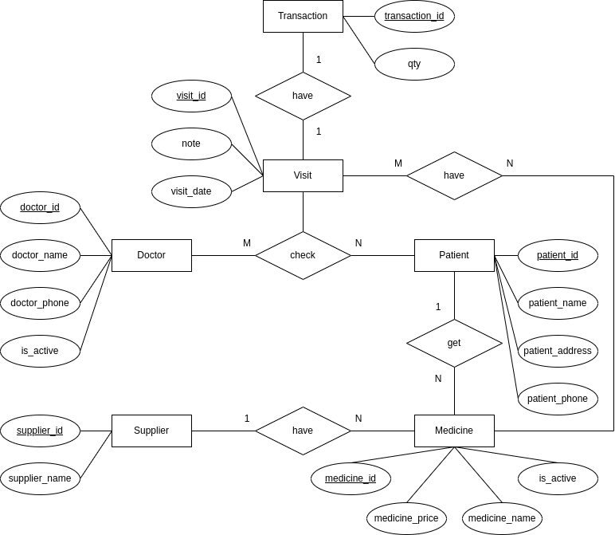

# e-Clinic sehati
A project by **Mikkel Nurfalah**
<p>&nbsp;</p>

# Introduction
e-Clinic is an application for managing data in a clinic such as data for patient, doctor, visit, transaction, medicine and supplier. This application was built with java spring boot.
<p>&nbsp;</p>

# Environment Variables
These are the env variables used for this application, the file is in /src/main/resources/application.properties and set those values in intellij as you need
- DB_HOST=localhost
- DB_NAME=db_e-clinic_sehati
- DB_PORT=5432
- DB_USERNAME=postgres
- DB_PASSWORD=1234
- API_PORT=7777
<p>&nbsp;</p>

# ERD (Entity Relationship Diagram)

<p>&nbsp;</p>

# RESTFUL API

## Using Postman
you can import collection into postman with file /E-CLINIC SEHATI.postman_collection.json
<p>&nbsp;</p>


## Using Swagger
you can use this link in your browser after run the project
http://localhost:7777/swagger-ui/index.html
<p>&nbsp;</p>


# Services

## Patient
### - Get all patients
- Request URL : http://localhost:7777/patients
- HTTP Method : GET
### - Create patient
- Request URL : http://localhost:7777/patients
- HTTP Method : POST
- Sample Request Body :
```
{
  "patientId": 0,
  "patientName": "string",
  "patientAddress": "string",
  "patientPhone": "string",
  "patientBirthdate": "2022-12-16T14:49:37.681Z"
}
```
### - Update patient
- Request URL : http://localhost:7777/patients/{id}
- HTTP Method : PUT
### - Delete patient
- Request URL : http://localhost:7777/patients/{id}
- HTTP Method : DELETE
<p>&nbsp;</p>


## Doctors
### - Get all doctors
- Request URL : http://localhost:7777/doctors
- HTTP Method : GET
### - Create doctor
- Request URL : http://localhost:7777/doctors
- HTTP Method : POST
- Sample Request Body :
```
{
  "doctorId": 0,
  "patientId": 0,
  "visitDate": "2022-12-16T13:35:19.748Z",
  "complaints": "string",
  "note": "string"
}
```
### - Update doctor
- Request URL : http://localhost:7777/doctors/{id}
- HTTP Method : PUT
### - Delete doctor
- Request URL : http://localhost:7777/doctors/{id}
- HTTP Method : DELETE
<p>&nbsp;</p>


## Suppliers
### - Get all suppliers
- Request URL : http://localhost:7777/suppliers
- HTTP Method : GET
### - Create supplier
- Request URL : http://localhost:7777/suppliers
- HTTP Method : POST
- Sample Request Body :
```
{
  "supplierId": 0,
  "supplierName": "string"
}
```
### - Update supplier
- Request URL : http://localhost:7777/suppliers/{id}
- HTTP Method : PUT
### - Delete supplier
- Request URL : http://localhost:7777/suppliers/{id}
- HTTP Method : DELETE
<p>&nbsp;</p>


## Medicines
### (You will need data from supplier first before you can create medicine)
### - Get all medicines
- Request URL : http://localhost:7777/medicines
- HTTP Method : GET
### - Create medicine
- Request URL : http://localhost:7777/medicines
- HTTP Method : POST
- Sample Request Body :
```
{
  "medicineName": "string",
  "supplierId": 0,
  "medicinePrice": 0
}
```
### - Update medicine
- Request URL : http://localhost:7777/medicines/{id}
- HTTP Method : PUT
<p>&nbsp;</p>


## Visits
### (You will need data from doctor & patient first before you can create visit)
### - Get all visits
- Request URL : http://localhost:7777/visits
- HTTP Method : GET
### - Get visit by patient id
- Request URL : http://localhost:7777/visits/patient/{id}
- HTTP Method : GET
### - Create visit
- Request URL : http://localhost:7777/visits
- HTTP Method : POST
- Sample Request Body :
```
{
  "doctorId": 0,
  "patientId": 0,
  "visitDate": "2022-12-16T13:35:19.748Z",
  "complaints": "string",
  "note": "string"
}
```
### - Update visit
- Request URL : http://localhost:7777/visits/{id}
- HTTP Method : PUT
<p>&nbsp;</p>


## Transactions
### (You will need data from visit & medicine first before you can create transaction)
### - Get all transactions
- Request URL : http://localhost:7777/transactions?page={page}&pageSize={pageSize}
- HTTP Method : GET

### - Get daily income report
- Request URL : http://localhost:7777/transactions/daily-income-report
- HTTP Method : GET

<p>&nbsp;</p>

